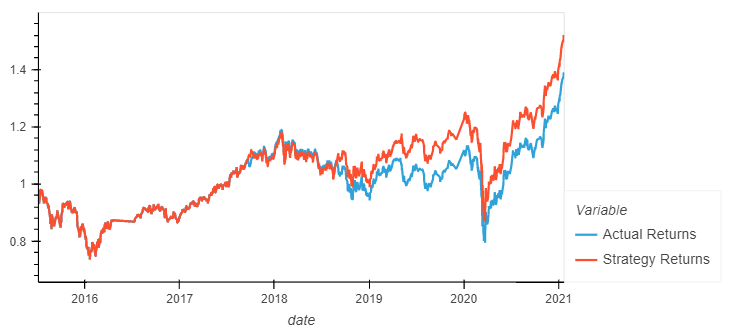
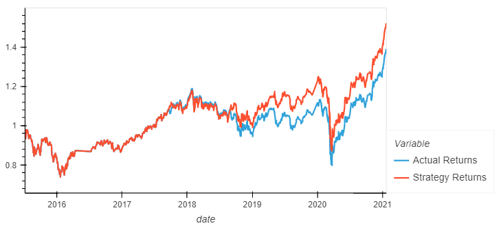
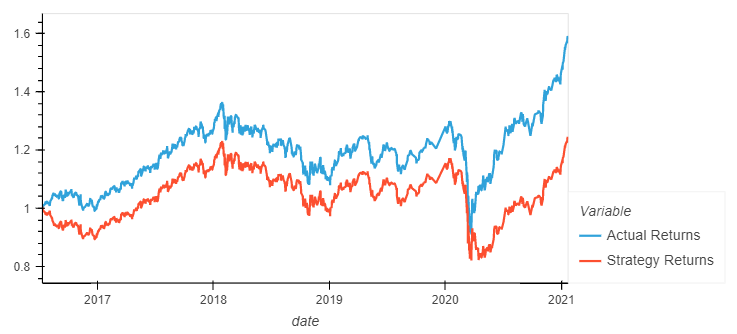
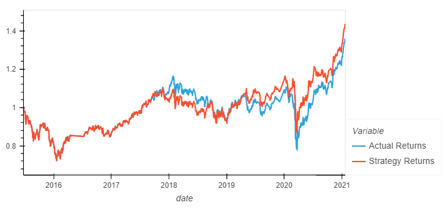
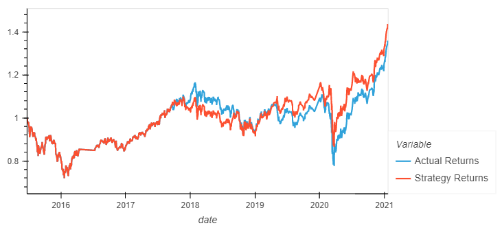

# Machine Learning Trading Bot

This challenge required the comparing of the SVM and Logistics Regression Models and how effective they are, along with how their accuracy and performance changes by altering the time frame the bot works and altering the SMA.

---

## Technologies

The credit risk resampling analysis leverages Python 3.8+ and utilizes the following project libraries and dependencies:
* [Streamlit](https://streamlit.io/) - a Python library that turns Python scripts into shareable web apps
* [Pandas](https://pandas.pydata.org/) - a software library designed for open source data analysis and manipulation
* Machine Learning
* Sklearn - SVM & Logistic Regression Models
* Matplotlib


---

## Installation Guide


Download Anaconda for your operating system and the latest Python version, run the installer, and follow the steps. Restart the terminal after completing the installation. Detailed instructions on how to install Anaconda can be found in the [Anaconda documentation](https://docs.anaconda.com/anaconda/install/).

This challenge uses Sklearn as part of the machine learning packages, to install Sklearn , run the following command:

```python
pip install sklearn
```

---  

### **Run instructions:**
To run this analysis, simply clone the repository or download the files. Open a terminal instance and start a jupyter lab instance by using the following command:
```python
jupyter lab
```
Once it has opened, navigate to the file named **machine_learning_trading_bot.ipynb**.
___
## Machine Learning Trading Bot

The first strategy we attempted was the base method that was predetermined for us. Both the SVM model and Logistics regression model were almost exactly the same with the actual profits till around 2019 before the crash in 2020 and then recovering in late 2020 to ultimately remain ahead of the actual profits.




I then altered the date and started the data from 2016 instead of 2015. There was a massive crash towards the end of 2015 and that helped the base data predict the future to make a profit whereas the sliced data starting from 2016 immediately fell behind the actual returns and got worse as it reached 2021.




A final strategy change was made, altering the SMA windows and reducing them by 25% (short window from 4 to 3 & long window from 100 to 75). This didn't have an as drastic change to the strategy returns as changing the beginning point of the data did. There was a period for most of 2018 when it fell behind but started to get better results in 2019 and pull ahead after the 2020 crash. (altered_SMA)




Overall, the base strategy had the best strategy returns compared to the other two altered strategies. Changing the starting date was by far the worst strategy being massively behind the actual returns. The altered SMA strategy returns did perform better than the actual returns but only just above, and ultimately not more than the base strategy returns.

---

## Contributors

This project was created as part of the module 14 challenge in the Monash University Fintech Bootcamp 2022 Program by:

Lachlan Andrews

Email: swerdna14@gmail.com

LinkedIn: lachlanjandrews
